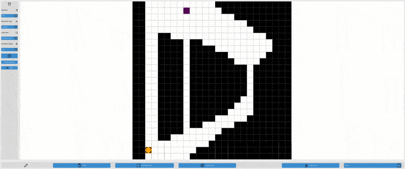

# Pathfinding Visualizer

An interactive pathfinding visualizer built with **Python** and **CustomTkinter**. Design custom environments, simulate algorithms in real time, and gain an intuitive understanding of how classic search algorithms work.

## Features

- **Algorithms Supported**:

  - Breadth-First Search (BFS)
  - Depth-First Search (DFS)
  - Uniform Cost Search (UCS)
  - Weighted A\* Search
  - Greedy Best-First Search (GBeFS)

- **Environment Editing**:

  - Draw and erase walls with the mouse
  - Place start/goal positions
  - Place walls during the simulation to watch how the algorithm adapts

- **Level Management**:

  - Save custom-designed maps to file
  - Load previously saved maps

- **Simulation Controls**:

  - Adjust simulation speed
  - Start, pause, and reset simulations at any time

---

## Preview

---

## Credits

- [Octicons](https://primer.style/octicons/) by GitHub — Licensed under the [MIT License](https://github.com/primer/octicons/blob/main/LICENSE).
